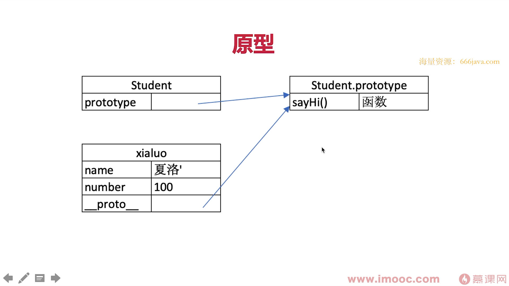
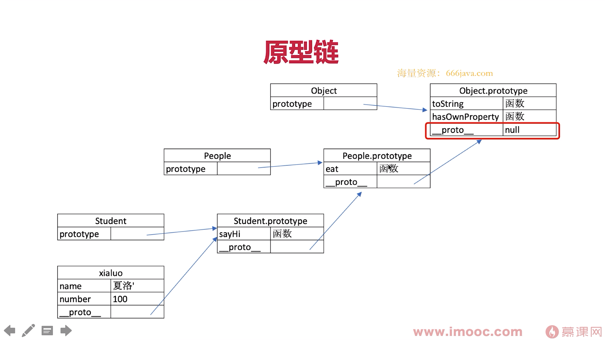
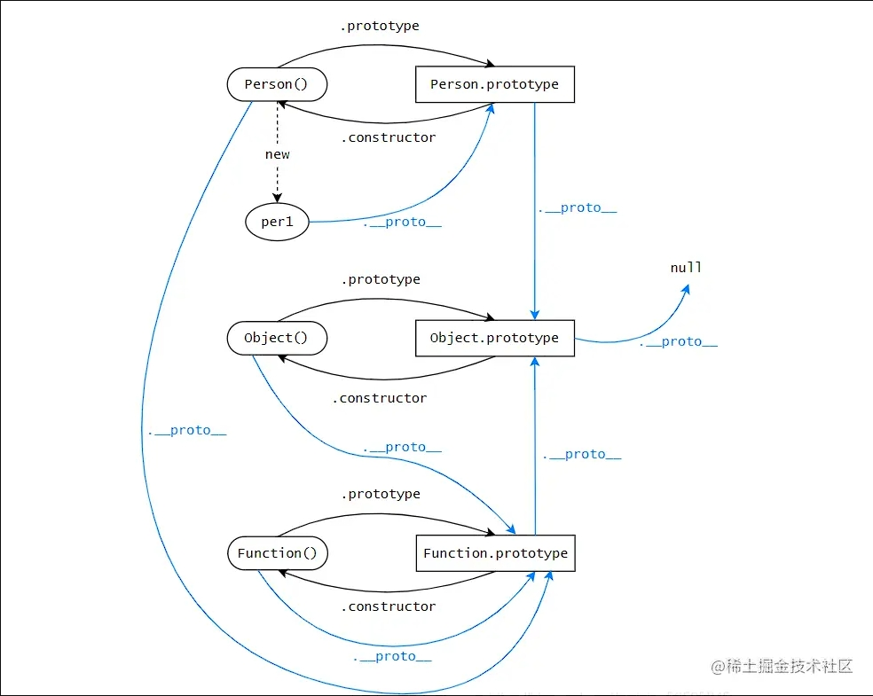

# 原型和原型链 - 知识点

## class

```js
// 声明一个类
class Student {
	constructor(name, number) {
		// 属性
		this.name = name;
		this.number = number;
	}
	// 方法
	sayHi() {
		console.log(`姓名 ${this.name}，学号 ${this.number}`);
	}
}

// 用类来声明对象
let xialuo = new Student('夏洛', 100);
xialuo.sayHi();
let madongmei = new Student('马冬梅', 101);
madongmei.sayHi();
```

#### static method:

static methods are valuable for encapsulating functionality that is logically connected to a class but does not require individual instances. They help organize code and keep class definitions clean and focused.

## 继承

```js
// 父类
class People {
	constructor(name) {
		this.name = name;
	}
	eat() {
		console.log(`${this.name} eat something`);
	}
}
// 子类
class Student extends People {
	constructor(name, number) {
		super(name);
		this.number = number;
	}
	sayHi() {
		console.log(`姓名 ${this.name}，学号 ${this.number}`);
	}
}
// 子类
class Teacher extends People {
	constructor(name, major) {
		super(name);
		this.major = major;
	}
	teach() {
		console.log(`${this.name} teach you ${this.major}`);
	}
}

const xialuo = new Student('夏洛', 100);
xialuo.sayHi();
const wanglaoshi = new Teacher('王老师', '语文');
wanglaoshi.teach();
```

---

## 类型判断

引用类型使用 instanceof

```js
xialuo instanceof Student // true
xialuo instanceof People // true
xialuo instanceof Object // true

[] instanceof Array // true
[] instanceof Object // true

{} instanceof Object // true
```

---

## 原型

以第二个例子为继承的例子

```js
// class 实际上是函数，可见是语法糖
typeof People; // 'function'
typeof Student; // 'function'
```

```js
// 隐式原型和显示原型
console.log(xialuo.__proto__);
console.log(Student.prototype);
console.log(xialuo.__proto__ === Student.prototype);
```

显示原型和隐式原型的关系（可**画图**说明！！！）

- 每个 class 都有 prototype 显示原型
- 每个实例都有 **proto** 隐式原型
- 实例的 **proto** 指向对应 class 的 prototype

基于原型的执行逻辑

- 执行实例方法时，如 `xiaoluo.sayHi()`
- 会先从实例自身属性查找（可通过 `hasOwnProperty` 判断）
- 如果找不到则自动去 **proto** 查找



---

## 原型链

以第二个例子为继承的例子。

```js
console.log(Student.prototype.__proto__);
console.log(People.prototype);
console.log(People.prototype === Student.prototype.__proto__);
```

继续补充原型**图示**！！！

根据之前的规则，再去演练 `xialuo.eat()`




## 原型和原型链综合演练

根据以上规则和图示，综合演练

- `xialuo.name`
- `xialuo.sayHi()`
- `xialuo.eat()`

继续延伸，`xialuo.hasOwnProperty` 从哪里得来？ —— 继续补充原型**图示**！！！

## 重点提示！！！

- class 是 ES6 语法规范，ECMA-262 标准
- ECMA 只是规定语法，即我们的代码编写方式
- 实现方式 ECMA 不管，以上是 V8 引擎实现方式 —— 但现在绝大多数运行环境都是用 v8 引擎（各个浏览器和 nodejs）

<hr style="border: 10px solid white;"/>

# 原型和原型链 - 解答

## 如何准确判断一个变量是数组类型

instanceof

## 实现一个简易的 jQuery ，考虑插件和扩展性

基本框架

```js
class jQuery {
    constructor(selector) {
        const result = document.querySelectorAll(selector)
        const length = result.length
        for (let i = 0; i < length; i++) {
            this[i] = selectorResult[i]
        }
        this.length = length
    }
    get(index) {
        return this[index]
    },
    each(fn) {
        for (let i = 0; i < this.length; i++) {
            const elem = this[i]
            fn(elem)
        }
        return this
    },
    on(type, fn) {
        return this.each(elem => {
            elem.addEventListener(type, fn, false)
        })
    }
}
```

插件机制

```js
// 使用继承 —— 基于 jQuery 基本功能，再造一个更强大的轮子
class myJQuery extends jQuery {
    constructor(selector) {
        super(selector)
    }
    // 扩展自己的方法
    addClass(className) {
    },
    style(data) {
    }
}

// 使用原型 —— 还用 jQuery ，仅仅扩展一个功能而已
jQuery.prototype.dialog = function (info) {
    console.log(this) // this 即 jQuery 对象
}
```

## class 是语法糖，其本质是什么？

- 原型图示
- 执行规则
